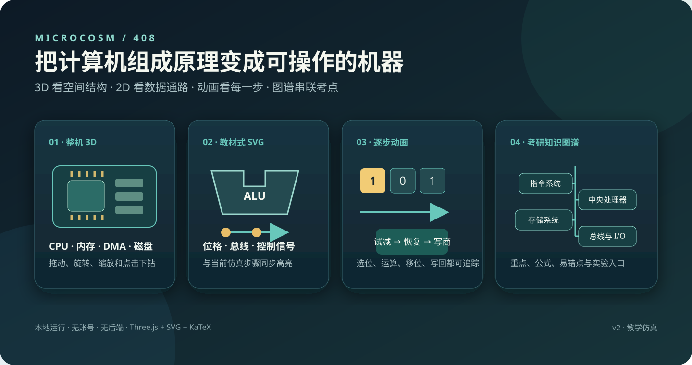

# 微机 · Microcosm 408

面向 408 计算机组成原理复习的交互式硬件仿真与知识学习系统。它把整机、CPU、存储器、I/O、运算器和指令执行从静态教材图变成可旋转、可点击、可逐步播放的学习场景。



3D 视图用于理解整机与部件的空间结构，2D SVG 用于精读教材式数据通路。两种视图共享同一步骤和状态；点击寄存器、芯片、总线或运算部件，可以直接查看数值来源、当前处理、写回去向和本步考点。

## 为什么做这个项目

计算机组成原理最难的地方往往不是记住名词，而是同时建立三种联系：硬件放在哪里、数据怎样流动、题目中的位宽与时序如何落到每一步。本项目用一条连续学习路径把三者串起来：


## 可以学什么

| 模块 | 可交互内容 | 适合复习的考点 |
| --- | --- | --- |
| 整机 | CPU、内存、DMA、外设接口、磁盘的 3D 总览与下钻 | 五大部件、总线连接、整机工作过程 |
| 运算器 | 8 位全加器、移位加法乘法、恢复余数除法 | 进位链、部分积、试减/恢复、商位生成 |
| CPU | 数据通路、ADD/LOAD 微操作、硬布线与微程序控制 | 指令周期、控制信号、寄存器传送 |
| 指令系统 | 8 种寻址、条件转移、CALL/RET | 有效地址、机器字长、CISC/RISC、栈 |
| 流水线 | 五级流水、RAW、LOAD-use、转发、暂停、冲刷 | 吞吐率、数据冒险、控制冒险 |
| 存储器 | 芯片阵列、位扩展、字扩展、同时扩展、突发传输 | 片选、容量计算、并行组织、地址译码 |
| 页式存储 | TLB、页表、缺页与物理地址形成 | 地址划分、页表项、命中与缺页 |
| I/O | 查询、中断、DMA、接口寄存器复用 | 程序查询、中断响应、DMA 总线仲裁 |
| 磁盘 | 盘面、磁道、柱面、扇区、磁头与 CHS/LBA | 容量、寻道、旋转延迟、地址转换 |

整机 2D 页面还提供双向、多层知识树，按“章节 → 专题 → 规则 → 例题/易错点”展开，并用重点、公式和易错标记帮助复习。学习搜索、章节聚焦和进度记录已经接入。

## 交互亮点

- 真实 WebGL 3D 场景，支持旋转、平移、缩放、聚焦与复位。
- 教材式矢量原理图，局部放大后仍保持清晰，支持拖动与缩放。
- 算术动画直接标出当前选中的位，并显示试减、恢复、移位、补位和写回。
- 点击数值或硬件即可对照“操作前 → 操作后”，同时显示来源、处理和去向。
- Markdown 与 KaTeX 渲染公式；界面默认避免误选正文，输入区域仍可正常编辑。
- 参数、速度、单步、回退、重播和时间轴可控；每个实验保留独立步骤。

## 本地运行

```sh
npm ci
npm start
```

打开 http://localhost:5173 。Three.js 已锁定版本并在本地加载，安装依赖后不需要联网。需要支持 WebGL 2 的浏览器；无法启动时显示原因并提供 SVG 2D 入口。

```sh
npm test
```

## 当前实现状态

- 整机：风格化 CPU 散热器、内存条/颗粒/金手指、DMA 控制器、外设接口插座、磁盘。点击进入独立部件页面。
- 内存：4 字 × 4 位芯片单元阵列；位扩展、字扩展、字位同时扩展；外壳与阵列展开；片选、同组并行输出、4 拍突发回绕。
- 磁盘：3 盘片、6 盘面、8 磁道/面、12 扇区/道；柱面高亮、联动磁头、选中扇区、寻道及旋转对准、控制器传输；可展开盘片。
- 外设：DMA 请求/总线授权/数据搬运/完成中断；查询、中断模式；读写复用的控制、状态和数据寄存器。
- CPU：原有纯逻辑教学 CPU 保留，真实取指与指令执行；汇编编辑和输出；可从 CPU 进入加法器、乘除法器及触发器。
- 乘除法：位槽寄存器、显示 0/1 的位标记、加法/试减/恢复通路；每轮三阶段，显示完整 16 位乘积或 9 位试减值。
- 页表与触发器：固定页表映射/缺页、理想 D 触发器采样流程。

3D 支持 OrbitControls 旋转、平移、缩放、聚焦和复位；2D 支持 SVG 拖动/缩放。视图切换不改变步骤，页面导航保留每页参数和步骤。播放/暂停、前后单步、时间轴、速度和导出可用。数据随刷新重置，导出的 JSON 用于查看，尚无导入恢复。

## 项目结构

```text
src/
├── engine.js              # 教学 CPU 与指令执行核心
├── labs.js                # 实验目录、参数与状态帧
├── scene3d.js             # Three.js 硬件场景
├── scene2d.js             # SVG 原理图查看器
├── arithmetic-view.js     # 加、乘、除逐步动画
├── knowledge-tree.js      # 递归知识图谱数据
├── learning-nav.js        # 搜索、定位与学习进度
└── step-trace.js          # 数值来源、处理、去向追踪
tests/                     # 引擎、图形、布局与展示测试
docs/                      # 架构、大纲覆盖、质量检查与路线图
```

浏览器页面没有后端依赖，仿真状态由纯逻辑模型生成，再分别投影到 3D、2D 和讲解面板。这个分层保证切换视图时不会重新开始实验。

## 模型边界

这是教学仿真，不是现实主板、物理电路或完整计算机模拟器。不同实验共享帧协议但各自独立：DMA 整机场景不与 CPU 汇编程序联合执行。存储器只展示代表性 4×4 位阵列；展开体现封装层次，不声称 DRAM 单元普遍垂直堆叠。突发仅模拟计数和数据拍，未实现完整 SDRAM ACT/PRE/刷新等命令时序。

磁盘 CHS 为教学几何，非现实硬盘性能仿真；现代设备通常向主机提供 LBA。查询/中断接口采用一种示例端口映射，不指代特定商用芯片。

## 大纲

参考可核对的 2026 年大纲公开转载；2026-09-10 尚未核实 2027 官方全文。已实现内容及尚未实现的全考纲项目在「2026 考纲与模型边界」中说明。

- [2026 大纲参考文本](https://www.kmxwd.com/uploads/images/20251015/68eef5daf0564.pdf)
- [教育考试院大纲入口](https://www.neea.edu.cn/html1/category/1509/6235-1.htm)

架构和模型假设见 [架构说明](docs/ARCHITECTURE.md)，大纲重点标注见 [大纲标注说明](docs/SYLLABUS-MARKING.md)，分阶段建设计划见 [学习系统路线图](docs/LEARNING-ROADMAP.md)，最近一次检查见 [质量检查记录](docs/QA-2026-09-12.md)。


## v2.1 图文学习界面

十个实验页面使用教材式 SVG 原理图，提供位格寄存器、标准 ALU 轮廓、控制虚线、位宽标记、当前步骤标签和可点击的流程图。加法器页面展开 8 位全加器及进位链。乘法器为无符号移位相加算法，不将其与 Booth 算法混用。绘图符号参考用户提供的教材示意图与 [Cornell CS3410 算术教学资料](https://www.cs.cornell.edu/courses/cs3410/2017sp/schedule/slides/03-numbers-and-arithmetic-bw.pdf)，图形由本项目自行绘制。

学习布局采用大画布与同步讲解侧栏，可展开画布；参数折叠，正文和公式分别通过 `src/prose.js` 中的 Marked 与 KaTeX 本地渲染。界面默认禁止拖动选中文字，输入框仍可正常选择、编辑。3D 信号线改为贴近板面的细线、折线路径和小型传输标记。

运行 `npm test` 检查运算、实验状态，以及全部页面各步骤的图文渲染。

## v2.3 双向知识导图与细分实验

整机的2D视图使用以“计算机组成原理”为中心的双向SVG树：左侧组织系统概述、数据运算、存储系统，右侧组织指令系统、CPU、总线和I/O。章名可定位，小节可展开，知识叶节点给出概念解释、计算方法、数值例子与易错辨析；仿真叶节点可进入实验。展开时为正文保留独立高度，支持拖动、缩放和收起。

新增独立实验：8种寻址、条件分支与CALL/RET；硬布线/微程序控制下的ADD/LOAD微操作；五级流水线的RAW、LOAD-use、转发、暂停与分支冲刷；可屏蔽中断的响应、现场保存、服务与返回。ISA页面采用独立教学格式，不与原有CPU指令编码混用。

算术页面增加选中位、运算区、移动数字、移位补入位和写回动画，单步与重播均可播放当前过程。触发器保留为寄存器基础选学。

这不是全考纲仿真已经完成：浮点运算、完整Cache替换与写策略、交叉存储时序、SSD、段/段页、多重中断、多处理器等仍有缺口。导图与覆盖说明明确区分知识讲解和可执行仿真。章节组织参照[王道2026出版社目录](https://phei.com.cn/module/goods/wssd_content.jsp?bookid=66399)，重点/难点是教学建议而非官方分值排名。

## v2.4 章末回顾式多层图谱

知识数据改为递归树结构：章节→专题→分类/结构→规则→解释或例题，支持所有分支独立展开和收起。ALU细分功能、输入、输出、全加器；除法细分结果约束、异常条件、恢复余数步骤；流水线细分冒险、RAW、转发与LOAD-use。重点、易错、公式、例题直接标在对应节点，不再统一附加两段说明。图谱为原创教学归纳，参照用户提供的章末回顾图组织层级，未声称逐页复刻教材。

连接线与节点下划线共用端点；递归布局按子树高度留白。窄窗口展开优先放大子级，并用底部路径显示上下文。布局测试覆盖全部节点展开、左右同层无重叠及深层收起。
